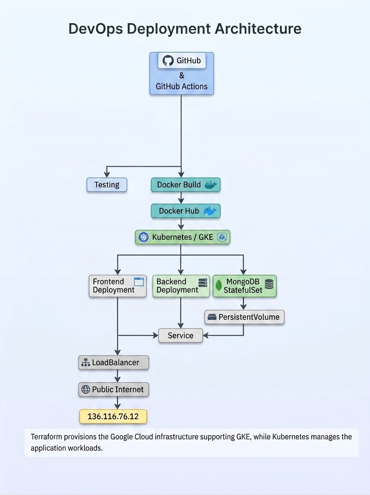

# BookHaven

BookHaven is a MERN-stack library catalog application deployed through a complete DevOps pipeline. The project demonstrates source control, CI/CD, containerization, infrastructure as code, configuration management, and Kubernetes orchestration on Google Kubernetes Engine (GKE).

## Live Application

**Live URL:** http://136.116.76.12

The frontend is exposed through a Kubernetes `LoadBalancer` Service.

## Architecture

The application consists of:

- **React frontend** served by Nginx
- **Node.js / Express backend** providing the REST API
- **MongoDB** for persistent book data
- **Docker** for containerization
- **Docker Compose** for local orchestration
- **GitHub Actions** for CI/CD
- **Docker Hub** for container image publishing
- **Terraform** for Google Cloud infrastructure provisioning
- **Ansible** for configuration management
- **Kubernetes / GKE** for production orchestration
- **PersistentVolumeClaim** for MongoDB persistence

## Repository Structure

```text
BookHaven/
├── .github/
│   └── workflows/
│       └── ci-cd.yml
├── backend/
│   ├── Dockerfile
│   ├── .dockerignore
│   └── ...
├── client/
│   ├── Dockerfile
│   ├── .dockerignore
│   └── ...
├── k8s/
│   ├── backend.yaml
│   ├── frontend.yaml
│   ├── kustomization.yaml
│   └── mongodb.yaml
├── roles/
│   ├── backend-deployment/
│   ├── docker-setup/
│   ├── frontend-deployment/
│   └── setup-mongodb/
├── terraform/
│   ├── main.tf
│   ├── outputs.tf
│   ├── providers.tf
│   ├── variables.tf
│   └── terraform.tfvars.example
├── docker-compose.yml
├── explanation.md
└── README.md


## Architecture Diagram

The following diagram illustrates the complete BookHaven DevOps architecture and how the application moves from source control through CI/CD, containerization, infrastructure provisioning, and Kubernetes deployment.


